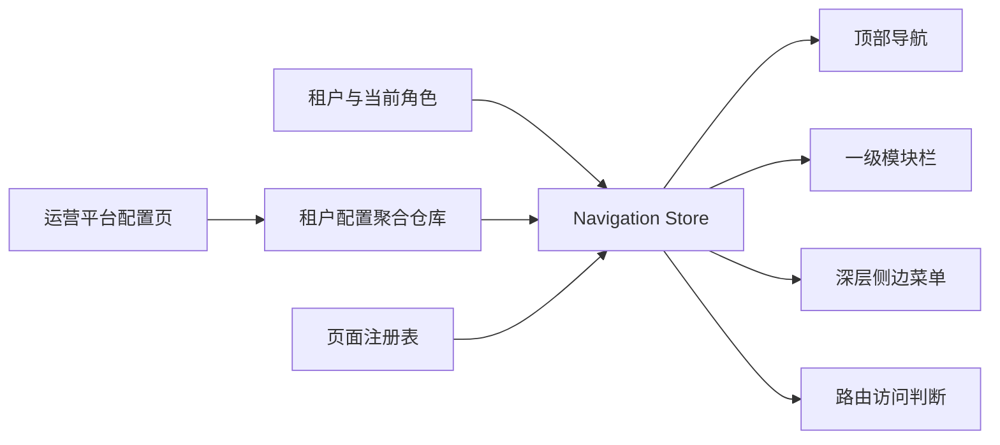

# 智慧校园运营管理平台

面向学校、教育局、教育机构和平台运营人员的多租户 SaaS 管理前端。项目当前重点验证统一工作台、分层导航、租户级菜单配置、组织管理和角色权限等平台基础能力，为后续接入真实业务页面与服务端 API 提供可替换的前端架构。

## 当前状态

项目处于可交互前端原型阶段：主要管理流程已经形成闭环，但数据仍保存在浏览器 `localStorage`，身份、权限和路由守卫只在前端生效，不能替代生产环境的服务端鉴权。

当前已经实现：

- 学校、教育局、机构、运营平台四类租户及租户切换。
- 租户独立的工作台入口，可配置名称、图标、顺序和显示状态。
- 模块化 SaaS Shell：工作台模式无侧栏；业务模式包含一级模块栏、顶部二级导航和三级/四级侧边菜单。
- 四级菜单配置：一级模块 → 二级目录 → 三级目录 → 内部页面或外部链接。
- 菜单增删查改、行内编辑、抽屉编辑、显隐、同级排序和跨层级拖拽。
- 页面注册表：菜单只关联已注册页面，不直接保存 Vue 组件路径。
- “功能开发中”统一缺省页，允许先配置菜单，再逐步替换为真实页面。
- 组织管理：新增、编辑、启用、停用和删除学校、教育局、机构。
- 角色管理与租户级 RBAC 菜单权限。
- 菜单和路由按当前租户、角色、显隐状态共同过滤。
- 菜单、工作台和角色以单个租户配置聚合原子保存，并执行结构与领域语义校验。
- 存储损坏时先保留原始数据，再执行默认模板恢复；备份失败时停止覆盖并显式报错。

## 产品与导航模型

### 工作台模式

访问 `/workbench` 时，顶部展示“工作台 + 当前租户一级业务模块”，页面不显示左侧菜单。工作台目前使用演示指标和占位数据，后续可以按租户类型接入真实业务看板。

### 业务模块模式

进入业务模块后，应用 Shell 保持挂载，只更新当前导航内容和页面区域：

```text
AppLayout
├── 一级模块图标栏 Module Rail
└── App Shell
    ├── Header：当前一级模块的二级目录
    └── Body
        ├── Sidebar：当前二级目录下的三级目录和四级页面
        └── RouterView：业务页面
```

内部导航使用 Vue Router 的 `RouterLink`，顶部 Header 不随业务子路由重新挂载；模块栏、侧边栏和页面内容分别承担自己的过渡动画。

### 菜单与页面的关系

菜单和页面是两个不同的资源：

- 页面由开发人员实现，并在 `src/config/page-registry.ts` 注册路径、组件、可用租户类型和管理权限。
- 菜单由运营人员配置，只保存页面的稳定 `pageKey`。
- 删除菜单不会删除页面代码；重新创建菜单时，可以再次从页面资源下拉列表关联该页面。
- 尚未开发真实页面时，可以关联“功能开发中缺省页”。该资源允许被多个菜单使用，并通过菜单 ID 生成独立地址。

## 运营平台能力

运营平台是超级管理入口，默认在“系统管理”模块下提供以下页面：

| 页面 | 地址 | 能力 |
| --- | --- | --- |
| 组织管理 | `/system/organization` | 维护学校、教育局、机构及其启用状态 |
| 角色管理 | `/system/roles` | 按租户维护内置角色和自定义角色 |
| 菜单配置 | `/system/menu-config` | 维护工作台、菜单树、页面关联及角色可见范围 |

运营平台租户本身固定启用且不可删除。上述页面带有 `requiresAdmin` 限制，普通角色不能直接访问。

## 权限模型

当前采用租户级 RBAC：

- 当前角色来自登录会话的租户角色映射，Header 不提供客户端角色切换入口。
- 每个租户拥有独立角色列表和菜单授权。
- 默认内置“管理员”和“老师/职员”角色。
- 管理员固定拥有当前租户全部可见菜单，不需要在菜单配置中重复勾选。
- 普通角色按内部页面或外部链接叶子节点授权；父级模块和目录根据已授权子节点自动出现在导航中。
- 菜单显隐是租户级总开关，角色权限是在其基础上的二次过滤。
- 无权访问的路由会跳转到该角色第一个可访问页面；没有可访问页面时进入 `menu-unavailable`。

这套检查用于当前原型的前端体验。生产环境仍需由服务端对用户身份、租户归属、接口资源和操作权限做最终校验。

## 已实现页面与占位页面

当前包含较完整交互或独立页面实现的区域：

- 租户工作台。
- 运营平台：组织管理、角色管理、菜单配置。
- 学校校园安全：设备列表、人员分组、特殊日期、临时授权、设置。
- 教育局托管学堂：机构审核列表、审核详情及相关操作弹窗。

页面注册表中还有多项学校、教育局和机构业务资源，当前主要由通用占位页面承载。判断页面是否已经真实开发，应以 `src/config/page-registry.ts` 中绑定的组件为准，而不是只看菜单是否存在。

## 技术栈

- Vue 3.5 + TypeScript 5.9
- Vite 7
- Vue Router 5
- Pinia 3
- Element Plus 2
- Lucide Vue / Element Plus Icons
- Vitest + Vue Test Utils + jsdom

## 环境要求

- Node.js `^20.19.0` 或 `>=22.12.0`
- npm

## 本地开发

```bash
npm install
npm run dev
```

Vite 启动后访问终端中显示的本地地址。常用入口：

```text
/workbench
/system/organization
/system/roles
/system/menu-config
```

系统管理页仅允许管理员角色访问，并会自动切换到运营平台租户。

## 工程检查

```bash
npm test          # 运行 Vitest 测试
npm run type-check
npm run lint
npm run build
npm run check     # 依次执行 lint、类型检查、测试和生产构建
```

测试主要覆盖菜单树和层级校验、租户配置聚合、组织仓库、角色仓库、权限过滤、路由访问、持久化失败与回滚等关键路径。GitHub Actions 会在 push 和 pull request 时运行同一套质量门禁，并审计生产依赖。

## 核心架构



关键设计边界：

- `page-registry.ts` 是内部页面资源和路由的代码级事实源。
- `menu-template-definitions.ts` 只定义默认模板素材，`menu-templates.ts` 负责将其转换为四类租户的初始化记录；两者不参与运行时导航。
- `features/*/repository` 隔离持久化实现，页面和 Store 不直接操作存储格式。
- Pinia Store 负责组合租户、菜单、工作台和角色状态。
- `tenant-route-access.ts` 负责前端路由可访问性和回退地址。
- `AppLayout.vue` 是持续挂载的应用 Shell，子页面只在内部 `RouterView` 中切换。

## 浏览器存储

当前数据模型按具体租户隔离：

| 数据 | localStorage key |
| --- | --- |
| 组织列表 | `operation-platform:tenants:v1` |
| 租户菜单、工作台与角色聚合 | `operation-platform:tenant-configuration:v1:<tenantId>` |

旧版菜单、工作台和角色的三个独立 key 只用于首次迁移，迁移后运行时统一读写聚合 key。首次读取不到数据时会写入默认模板。JSON 损坏、版本不兼容或语义校验失败时，原值会备份到带 `invalid` 和时间戳的 key，然后恢复完整租户配置；如果备份失败，则停止恢复，避免静默覆盖原数据。

清除浏览器站点数据会同时清除当前原型中维护的组织、菜单、工作台和角色配置。

## 主要目录

```text
src/
├── components/                         全局 Header、模块栏、侧边菜单与通用组件
├── config/
│   ├── page-registry.ts                页面资源与动态路由注册表
│   ├── menu-template-definitions.ts     默认菜单模板素材
│   ├── menu-templates.ts               租户类型默认菜单模板
│   ├── page-tabs.ts                     具体业务页面的局部 Tab
│   └── school-menu-outline.ts          学校默认菜单层级
├── features/
│   ├── menu-config/                    菜单领域模型、校验与仓库
│   ├── shell-config/                   工作台 Shell 配置仓库
│   ├── tenant/                         组织/租户仓库
│   ├── tenant-config/                  菜单、工作台与角色的原子聚合仓库
│   └── access-control/                 角色仓库和菜单权限计算
├── layouts/AppLayout.vue               持续挂载的 SaaS 应用 Shell
├── router/                              路由定义和租户权限守卫
├── stores/                              运行时导航与运营管理状态
└── views/
    ├── system/                          组织、角色、菜单配置
    ├── security/                        校园安全页面
    └── bureau/                          教育局业务页面
```

## 新增一个可关联页面

1. 在 `src/views` 下实现页面组件。
2. 在 `src/config/page-registry.ts` 注册唯一 `key`、路径、组件、租户类型和权限属性。
3. 打开运营平台的菜单配置，为目标租户新增“内部页面”菜单。
4. 在关联页面下拉列表中选择刚注册的页面。

路由由页面注册表统一生成，不需要再在菜单记录中填写组件路径，也不应重复手写同一路由。

## 接入生产后端时的替换点

当前仓库接口已经将业务状态与 `localStorage` 分离。后续接入后端时，主要工作包括：

- 将组织与租户配置聚合 repository 替换为带事务和版本控制的 API 实现。
- 接入登录会话和真实用户、租户、角色数据。
- 在服务端实施菜单资源和操作权限校验。
- 为配置数据增加版本、发布、审计和并发控制。
- 将工作台和占位页面替换为真实业务接口与页面。
- 增加服务端鉴权集成、自动化端到端测试和生产部署配置。

## 设计资料

- [租户菜单配置设计](docs/superpowers/specs/2026-06-30-tenant-menu-configuration-design.md)
- [租户菜单配置实施计划](docs/superpowers/plans/2026-06-30-tenant-menu-configuration.md)

以上两份文档记录了菜单配置功能的早期设计和实施过程，其中部分三级菜单、固定系统页等描述已被当前四级菜单和可配置运营平台方案演进覆盖；当前行为以本 README 和代码为准。
