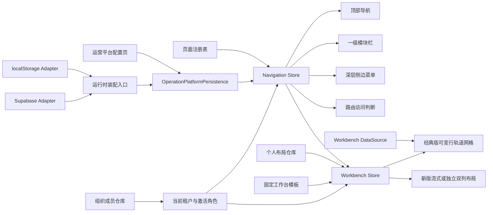

# 智慧校园运营管理平台

面向学校、教育局、教育机构和平台运营人员的多租户 SaaS 管理前端。项目当前重点验证统一工作台、分层导航、租户级菜单配置、组织管理和角色权限等平台基础能力，为后续接入真实业务页面与服务端 API 提供可替换的前端架构。

## 当前状态

项目处于可交互前端原型阶段，已接入 Supabase Auth、Postgres 和 RLS。Supabase 模式下，组织、成员、租户菜单/角色配置、当前角色、个人工作台布局、可视化主题、机构审核与门禁设备数据以云端数据库为事实源，可跨浏览器共享；`localStorage` 仅保留显式本地演示、E2E 和旧数据迁移能力。

当前已经实现：

- 学校、教育局、机构、运营平台四类租户及租户切换；当前机构按用户保存在浏览器登录会话中，刷新后继续恢复，退出登录时清除，重新登录后回到默认机构；独立页面的临时租户上下文不会覆盖外层平台状态。
- 租户独立的工作台入口，可配置名称、图标、顺序和显示状态。
- 按“组织类型 × 管理/业务角色”提供 8 套固定 Bento 组件清单；经典工作台使用内容自适应的 12 列逻辑行网格，支持拖拽、横向宽度调整和菜单跨行，新版提供“完整流式”和“分两列”两种轻量布局，可调整顺序、半行/整行宽度或主辅列归属；两版布局独立保存，但共用组件、数据与权限。
- 模块化 SaaS Shell：工作台模式无侧栏；业务模式包含一级模块栏、顶部二级导航和三级/四级侧边菜单。
- 全局 AI 运营助手侧栏：Header 入口在桌面端推入右侧工作区、移动端覆盖内容区；打开、切换路由或切换租户时重新读取当前页面。页面可通过 Provider 注册结构化上下文，未注册时仅从 `.app-content-inner` 提取受限文本，不采集输入框、按钮、脚本和应用 Header。Supabase 模式通过 Edge Function 接入 DeepSeek，本地模式使用演示回复验证会话、流式渲染与上下文链路。
- 四级菜单配置：一级模块 → 二级目录 → 三级目录 → 内部页面或外部链接。
- 教育局默认提供“基础平台、协同办公、教育管理、公共服务、AI 精准教学、AI 教师发展、AI 教育治理、智慧大脑”通用菜单；模板只在首次初始化或手动恢复默认时应用，不覆盖已有租户配置。
- 菜单增删查改、行内编辑、抽屉编辑、显隐、同级排序和跨层级拖拽。
- 页面注册表：菜单只关联已注册页面，不直接保存 Vue 组件路径。
- 教育局“区域教育总览”已实现独立数字孪生首页：以真实榕城区 GeoJSON 构建 Three.js 三维区域地图，展示教育局与 43 个公开学校 POI，并支持“学校点位与飞线 / 学校数据能量锥峰”图层切换、同场景镇街聚焦下钻、平滑返回和五套主题切换；页面在新标签打开且不加载应用 Shell。地图顶面按稳定镇街编码交替使用原色与轻微提亮色，学校网络点位使用批量细杆与三段断环发光立标；区级立标更高且更紧凑，默认立标透明度为 `0.56`，选中学校在区级、子级及自动导览中均按默认 5 秒轮播，以全透明度通过阻尼过渡提升至 `2.45` 倍杆高，三段断环在选中状态持续旋转，教育局使用独立的双层旋转信标。学校立标在图层或层级切换时从近地面自然长高，低弧飞线贴近地图表面并采用简单淡入与单光点流动。页面连续 5 分钟无点击、触摸、滚轮或键盘操作后，自动进入第一个有学校的镇街，每个镇街固定停留默认 30 秒并直接平滑切换到下一个同级镇街；遍历全部有效镇街后才返回区级，并重新等待 5 分钟开始下一轮。区级停留默认 300 秒、子集停留默认 30 秒，均可在地图调试面板实时调整。镇街巡航、学校 5 秒轮播与锥峰自身轮播是互不等待、互不干扰的独立机制；任意用户操作都会中断镇街巡航并重新计时。该巡航不修改地图原有的 10 秒空闲自动旋转恢复机制。右下角提供按 Figma 设计实现的“AI数据助手”悬浮入口，宽度由内容自适应并可在页面边界内拖拽调整位置；入口 WebGL CloudOrb 每 4 秒在 `listening` 与 `speaking` 状态间切换，拖动不会误触发跳转，窗口缩放后会自动保持在可见范围内；目标页尚未开发时保持不可导航，后续配置地址后使用新标签打开。地图材质调试入口以图标形式紧邻重置视角按钮。地图的屏幕构图偏移由相机投影层处理，手动拖拽与空闲自动旋转始终共用当前区县或镇街的真实地理中心，不再把构图偏移混入旋转轴心。
- 区域教育总览默认进入“能量锥峰”模式；地图调试面板提供默认开启的“自动平面旋转”开关，关闭后不影响镇街自动聚焦或数据轮播。地图空闲渲染帧率为 `24 FPS`，交互、悬停和相机过渡仍按 `60 FPS` 响应。
- 可视化页顶部主导航与底部导航共用 `DashboardSectionTabs` 和 `dashboard-sections.ts`，按同一份页面级 Tab 配置同步选中状态与可用性：当前“区域教育总览”和“学业质量监测”可切换，其余栏目继续显示为禁用占位，后续页面只需在配置源中启用。“学业质量监测”按筛选区、左右各三块和中部上下两块的驾驶舱结构组织内容，并以 `DashboardPanel`、`DashboardPanelHeader`、`DashboardPanelTabs`、`DashboardFilterBar` 和 `DashboardPanelSelect` 分离面板外壳、标题操作区、筛选控件与可替换图表内容；通用面板使用无圆角外壳、随主题变色的标题标记和位于标题操作区最右侧的独立说明 Tooltip。顶部已接入学期、年级和考试筛选及报告中心入口，首个“学业趋势对比”使用独立 `EChartCanvas` 呈现平均分、优秀率和合格率双轴柱线组合，并使用 ECharts 原生可切换图例、横轴标签避让及长数据缩放，其余业务图表继续占位。`EChartCanvas` 以模块化 ECharts 注册、合并到单帧的 ResizeObserver、最高 2 倍设备像素比和卸载销毁管理 Canvas 生命周期；学业质量模块使用异步组件，只在切换进入时加载 ECharts。五套可视化主题各自提供三组 `charts--*` 图表序列色和两种图表背景，白/黑中性色及 `dt-chart-*`、`dt-panel-*` 语义变量只作用于 `.regional-digital-twin`，不会进入外层 SaaS Shell；Canvas 图表直接复用主题中的类型化 `chartPalette`。页面级 Tab 切换使用仅包含 `transform/opacity` 的短促 GSAP 出入场时间线，并适配减少动态效果偏好。离开区域总览时会卸载 Three.js 地图并暂停学校轮播和镇街自动巡航，返回后重新挂载，避免隐藏页面继续消耗渲染资源。
- “功能开发中”统一缺省页，允许先配置菜单，再逐步替换为真实页面。
- 组织管理：新增、编辑、启用、停用和删除学校、教育局、机构，并在组织内通过登录邮箱绑定 Supabase Auth 用户，维护成员状态和多角色授权。
- 已登录用户可使用当前密码校验后直接修改新密码，不依赖验证码或管理员密钥。
- 角色管理与租户级 RBAC 菜单权限；被启用成员引用的角色禁止禁用、删除或恢复覆盖。
- 菜单和路由按当前租户、当前激活角色、显隐状态共同过滤。
- 菜单、工作台入口 Shell 和角色以单个租户配置聚合原子保存，并执行结构与领域语义校验；个人工作台布局独立按租户、用户和角色类型隔离。
- 存储损坏时先保留原始数据，再执行默认模板恢复；备份失败时停止覆盖并显式报错。

## 产品与导航模型

### 工作台模式

访问 `/workbench` 时，顶部展示“工作台 + 当前租户一级业务模块”，页面不显示左侧菜单。管理员使用管理型工作台，老师、职员及自定义非管理员角色使用业务型工作台；同一组织类型和角色类型共享完全一致的固定组件全集，组件数据根据当前组织变化。

工作台支持“经典工作台 / 新版工作台”切换，选择结果与两套个人布局一并保存在现有个人工作台记录中。经典版使用 12 列、可变行高的 Bento 网格：组件声明最小高度、建议高度和内容上限，单行组件参与所在逻辑行的高度计算，同一行按最高组件等高；桌面端只允许横向调整格数，不再手动拉伸行高。需要跨行时通过组件菜单选择“占 1 行”或“跨 2/3/4 行”，跨行组件使用所覆盖逻辑行高度与间距之和，但不反向撑高这些行，超出分配高度的内容在组件内部滚动。平板自动压缩为 6 列并取消跨行，手机按桌面顺序单列只读展示。新版包含两种轻量布局：“完整流式”每行展示一个整行组件或两个半行组件，同一双列行按较高组件等高填满；“分两列”使用主列/辅列两个互不关联的纵向流，支持 `4:2`（实际宽度比例 `2:1`）与 `6:2`（实际宽度比例 `3:1`），组件可在列内或跨列拖拽，每列分别从上到下排列且组件保持内容高度。双列编辑时两列投放容器始终拉伸到相同底部，短列尾部提供可直接追加的投放区域；拖到组件上半区或下半区分别插入其前后，并使用与被拖组件等高的卡片占位而不是细线。完整流式和分两列分别保存流式顺序与列内顺序，切换布局方式不会互相改乱排列。完整流式中的鼠标拖拽会继承目标位置的半行/整行宽度语义，拖到列表末尾则保留原宽度；菜单移动不触发自动改宽。新版只持久化布局方式、列宽比例、流式顺序、列内顺序、`span` 和列归属，不保存行坐标或组件高度，手机端统一转为单列。两个版本都以显式“保存/取消”提交修改，固定组件清单、业务数据、权限和组件设置能力保持共用。学校、教育局、机构和平台组件统一使用轻边框、低装饰的内容容器；教育局管理型和业务型模板额外提供快捷应用入口、局内新闻、信息公开、教学应用排行榜、消息与待办中心、日程与任务管理、个人成长与发展、我的订阅和通知公告。教育局日程使用 Element Calendar，按当前租户和登录用户从 Supabase 读取，支持跨月份查询、创建、编辑、查看、完成、取消、恢复和删除；未查看时间持久化到 `viewed_at`，已过期状态根据待处理日程的结束时间实时推导。待办、新闻公告、排行和订阅仍由类型化 Mock 数据源提供。

### 业务模块模式

进入业务模块后，应用 Shell 保持挂载，只更新当前导航内容和页面区域：

```text
AppLayout
├── 一级模块图标栏 Module Rail
└── App Shell
    ├── Header：当前一级模块的二级目录
    └── Body
        ├── Sidebar：当前二级目录下的三级目录和四级页面
        └── RouterView：业务页面
```

内部导航使用 Vue Router 的 `RouterLink`，顶部 Header 不随业务子路由重新挂载。当前只保留一级模块栏进入、退出时的短促过渡，侧边栏和业务页面切换不增加动画。

### AI 运营助手

`src/features/ai-assistant/page-context.ts` 是助手读取当前页面的上下文契约。上下文包含当前租户、路由、模块、菜单路径、页面标题、标题层级、受限页面正文，以及页面按需注册的结构化数据。复杂业务页应注册 `AssistantPageContextProvider`，避免依赖 DOM 文案推断业务状态；通用页面使用内容区文本回退。

页面快照在助手打开或路由变化时采集，但不会随每条消息发送。只有用户选择页面能力、明确引用当前页面/数据，或问题包含当前页面标题时才注入模型上下文；普通聊天与不引用页面的追问只发送会话历史。重复使用同一页面上下文时，Edge Function 保持稳定的 system prompt 前缀，以便 DeepSeek 自动上下文缓存生效。

侧栏会话状态由 `src/stores/ai-assistant.ts` 维护，并通过 `src/features/ai-assistant/` repository 按当前租户和登录用户隔离。Supabase 模式下，会话与消息保存在 `ai_conversations`、`ai_messages`；浏览器不能写入助手消息，`supabase/functions/ai-assistant` 使用当前用户 JWT 校验租户权限后调用 DeepSeek 并保存结果。函数将 DeepSeek SSE 转换为 NDJSON 事件流，浏览器逐分片更新当前消息，结束后服务端再将完整内容和 token 统计写入消息记录。

助手回复使用 `markdown-it` 渲染 Markdown，关闭原始 HTML，并通过 KaTeX 支持 `$...$` 与 `$$...$$` 公式。内容样式由 `src/features/ai-assistant/styles/vue-markdown.css` 提供，它基于 Typora Vue 主题整理并限定在 `.assistant-markdown` 内，避免修改 SaaS Shell 的全局排版。DeepSeek 密钥只存放在 Edge Function Secret 或本地忽略的 `supabase/functions/.env.local`，不得进入 `VITE_*` 环境变量。

### 菜单与页面的关系

菜单和页面是两个不同的资源：

- 页面由开发人员实现，并在 `src/config/page-registry.ts` 注册路径、组件、可用租户类型和管理权限。
- 独立可视化页面仍由同一页面注册表和路由守卫管理，可配置新标签打开，并通过显式 `tenantId` 查询参数恢复已授权租户上下文。
- 菜单由运营人员配置，只保存页面的稳定 `pageKey`。
- 删除菜单不会删除页面代码；重新创建菜单时，可以再次从页面资源下拉列表关联该页面。
- 尚未开发真实页面时，可以关联“功能开发中缺省页”。该资源允许被多个菜单使用，并通过菜单 ID 生成独立地址。

## 运营平台能力

运营平台是超级管理入口，默认在“系统管理”模块下提供以下页面：

| 页面 | 地址 | 能力 |
| --- | --- | --- |
| 组织管理 | `/system/organization` | 维护学校、教育局、机构、启用状态和组织成员 |
| 角色管理 | `/system/roles` | 按租户维护内置角色、自定义角色和角色成员引用状态 |
| 菜单配置 | `/system/menu-config` | 维护工作台、菜单树、页面关联及角色可见范围 |

运营平台租户本身固定启用且不可删除。上述页面带有 `requiresAdmin` 限制，普通角色不能直接访问。

## 权限模型

当前采用租户级 RBAC，Supabase Auth 提供真实用户身份，组织成员记录提供用户在各租户中的角色事实源：

- 当前登录用户在当前租户中的启用成员记录决定可用角色；最后使用机构仅在该用户仍具有访问权限时恢复，否则回退到首个可访问机构。
- 一个成员可以拥有多个角色；Header 在多角色时提供“当前角色”下拉切换。
- 菜单、工作台、默认入口和路由守卫只按当前激活角色计算，不把多个角色的菜单直接合并展示。
- 成员被禁用或角色被禁用后，不参与当前权限计算。
- 每个租户拥有独立角色列表和菜单授权。
- 默认内置“管理员”和“老师/职员”角色。
- 当前激活角色为“管理员”时，才展示管理员能力、管理型工作台和当前租户全部可见菜单，不需要在菜单配置中重复勾选。
- 普通角色按内部页面或外部链接叶子节点授权；父级模块和目录根据已授权子节点自动出现在导航中。
- 菜单显隐是租户级总开关，角色权限是在其基础上的二次过滤。
- 无权访问的路由会跳转到该角色第一个可访问页面；没有可访问页面时进入 `menu-unavailable`。
- 组织成员管理禁止删除、禁用或移除当前组织最后一个启用管理员成员，避免本地 demo 出现无人可管理的组织。

数据库表已启用 RLS，组织、配置和成员写入按平台管理员或租户管理员校验，个人布局和当前角色偏好仅允许本人在可访问租户内读写。页面按钮和路由守卫仍属于体验层；后续真实业务 API 也必须继续实施服务端资源与操作权限校验。

## 已实现页面与占位页面

当前包含较完整交互或独立页面实现的区域：

- 租户工作台。
- 运营平台：组织管理、角色管理、菜单配置。
- 学校校园安全：设备列表、人员分组、特殊日期、临时授权、设置。
- 教育局托管学堂：机构审核列表、审核详情及相关操作弹窗。
- 教育局智慧大脑：榕城区教育数字孪生首页，包含三维行政区地图、学校空间点位、类型统计、机构空间档案、地图悬浮、相机视角控制、镇街聚焦下钻和生态荧光/深海矩阵/城市琥珀/星河钴蓝/多维光谱五套主题。榕城区相邻的揭东区、普宁市、潮安区、潮阳区和金平区作为低对比度二维环境层展示；下钻时保持同一场景和投影，当前镇街提升为独立三维焦点、其余镇街压平，同级镇街仍可悬浮并点击平滑切换焦点，点击地图外层或面包屑可平滑返回区级视角。父级首次进入子级时应用子级默认相机 Z；子级同级切换保留用户旋转后的相机 Z。能量锥峰模式可独立配置子级焦点 Z，不影响学校网络视角。区域悬浮只向下增加厚度，顶面高度及学校点位、飞线、锥峰位置保持不变。区级流光使用完整榕城区边界，下级流光跟随当前镇街边界。地图使用 `OrbitControls` 并以地图厚度方向 `Z` 轴作为朝上方向，提供左键受限三维旋转、滚轮缩放及阻尼惯性，地图平移关闭；空闲时围绕当前区域或子级焦点缓慢旋转，任何手动视角操作都会暂停，10 秒无操作后从当前视角连续恢复。地图控制栏只保留学校网络/能量锥峰切换与平滑重置视角，不再提供相机视角持久化；页面保留地图物理材质实时调试面板。页面采用全视口地图底层与顶部、左右、底部 HUD 覆盖层，地图不会因信息面板缩窄；HUD 颜色、字体、间距、尺寸、层级和动效由独立页面设计令牌统一维护。页面 HUD、地图舞台、主题配置、数据适配与 Three.js 渲染器已分层。首版点位和行政区边界来自公开地理数据，正式上线前需由教育局权威台账校准。

当前区级流光、镇街下钻及相邻区县环境层使用 OpenStreetMap/Nominatim 的 ODbL 公开边界。榕城区政府公布现辖 16 个镇（街），公开数据可直接取得其中 13 个多边形；溪南、凤美、京冈三街道边界暂缺，渔湖街道仍采用 2022 年拆分前范围。页面会明确显示 `13/16` 覆盖状态，不将公开原型数据视为权威行政区划。`npm run map:refresh:rongcheng` 可重新获取镇街边界，`npm run map:refresh:rongcheng-context` 可同时重新获取榕城区完整区级边界与相邻区县环境边界；生成结果不写入运行时间并保持稳定顺序。`npm run map:normalize:rongcheng` 用于规范化已有镇街资产。后续取得权威数据时只需替换地图数据适配层。

页面注册表中还有多项学校、教育局和机构业务资源，当前主要由通用占位页面承载。判断页面是否已经真实开发，应以 `src/config/page-registry.ts` 中绑定的组件为准，而不是只看菜单是否存在。

## 技术栈

- Vue 3.5 + TypeScript 5.9
- Vite 7
- Vue Router 5
- Pinia 3
- Supabase Auth + Postgres + Row Level Security
- Element Plus 2
- Three.js 3D 地理可视化
- GSAP 3 驾驶舱入场与数据滚动动画
- Lucide Vue / Element Plus Icons
- Vitest + Vue Test Utils + jsdom
- Playwright 端到端测试

榕城区三维地图由项目内的独立渲染内核实现，使用分层 Three.js 场景、批量点位与飞线、学校数据能量锥峰和显式 GPU 资源生命周期。区级能量锥峰按公开学校点位聚合镇街学校数量；进入镇街后，默认使用全局对齐、固定 `0.025° × 0.025°` 范围的逻辑统计网格，学校按坐标归入网格，每个有学校的网格展示一座聚合锥峰。该网格跨度及锥峰的区级/子级尺寸、数量高度曲线、材质网格、底部渐变、光晕和显隐速度由渲染配置统一维护。锥峰配色跟随当前主题；“多维光谱”作为独立主题统一维护地图、HUD、飞线和锥峰色值，其基础单色为 `#2B67D1`，普通 HUD、地图标签、涟漪、飞线、环境环和页面强调线使用该钴蓝色系，选中学校及教育局立标使用光谱青 `#00FFD5`，与“星河钴蓝”的 `#2B67D1` 立标明确区分。锥峰按当前层级的数量范围分为少、中、多三档，共用深蓝底色 `#0D2AC2`，顶色依次为 `#00FFD5`、`#FFC800`、`#FFA97A`；五套主题统一使用基础透明度 `0.7`、高度透明增量 `0.6`、网格透明增量 `0.07`、悬停透明增量 `0.2` 和底部光晕透明度 `0.23`。地图顶面与底面使用 `#0A0B0F`，侧面使用 `#1FDDE0 → #0071DB` 渐变，外部环境地面使用 `#707070`、透明度 `0.06`。其余主题继续使用各自的侧边渐变，不受“多维光谱”参数覆盖。地图只保留顶面外轮廓和顶面内部边界，不绘制底部轮廓；底面填充仅渲染朝下的一面，避免从上方斜视时其边缘透过半透明侧壁。顶面边界与非焦点覆盖层参与深度测试，透明厚度侧面使用共享几何的深度预通过遮挡后方边界，避免低视角及子级聚焦时穿透显示；边界流光使用更高的透明组顺序，避免被焦点顶面或厚度侧面覆盖。地图顶面使用无程序噪波纹理的纯色标准材质并默认以透明度 `1` 写入深度，自发光默认为 `0`；五套主题的外部环境地面统一使用 `#707070`、透明度 `0.06`，网格底色、网格线及其透明度同样共享全局配置；行政区下方使用单个 `12000 × 12000` 超大平面的片元 Shader 按世界坐标生成低位网格；网格层底色默认为 `#23252F`、透明度 `0`，网格线默认为白色、透明度 `0.3`，并从中心向边缘平滑淡出。画布宿主背景同步使用网格层底色，避免低俯仰视角因色差出现地平线硬切；不再启用折射、透射、清漆等物理材质参数。行政区顶面与底面独立颜色、外部环境地面颜色与透明度、背景网格底色、线色及各自透明度、表面透明度、自发光、当前主题侧边颜色及锥峰透明度均可通过页面内“地图材质”调试模块实时调整，“多维光谱”的分档颜色也可在该模块中单独预览调整。只有主动降低顶面透明度时才切换到透明渲染队列，更新材质或主题属性时不重建地图几何。区级和子级都只默认显示一张锥峰数据卡片并按 5 秒轮播；悬停锥峰时立即切换至对应卡片并暂停轮播，移出后再继续。子级标签直接显示学校数量和学校名称，最多显示三行，超出时循环滚动。逻辑网格仅用于可视化统计，不作为真实行政区划，也不虚构质量、产值等业务指标。锥峰在图层切换、下钻和同级切换时从高度与透明度 `0` 平滑过渡；局端涟漪同样从零尺寸淡入并在循环交界淡出，避免圆环突现。地图复用现有投影、CSS2D 标签渲染器、Z-up 坐标系和图层资源释放机制。镇街边界来自 OpenStreetMap contributors，通过 Nominatim 获取并按 ODbL 使用。

## 环境要求

- Node.js `^20.19.0` 或 `>=22.12.0`
- npm

## 本地开发

```bash
npm install
npm run dev
```

复制 `.env.example` 为 `.env.local`，填写 `VITE_SUPABASE_URL` 和 `VITE_SUPABASE_PUBLISHABLE_KEY` 后，开发环境默认使用 Supabase。`SUPABASE_SECRET_KEY`、数据库密码和迁移用户 ID 只允许用于迁移脚本及 Supabase 集成测试，绝不能加 `VITE_` 前缀或提交到 Git。

登录账号在 Supabase Dashboard 的 Authentication → Users 中创建。新 Auth 用户会由数据库触发器自动创建基础 `profiles` 记录；随后在组织成员管理中输入该登录邮箱并分配角色，数据库会原子解析 Auth 用户 UUID 并写入成员关联。邮箱用于查找账号，运行时权限始终以稳定的 `auth_user_id` 为准。

Vite 启动后访问终端中显示的本地地址。常用入口：

```text
/workbench
/system/organization
/system/roles
/system/menu-config
```

系统管理页仅允许管理员角色访问，并会自动切换到运营平台租户。

## 工程检查

```bash
npm test          # 运行 Vitest 测试
npm run test:e2e  # 运行 Chromium 端到端测试
npm run test:e2e:supabase # 使用已加载的 .env.local 运行真实双浏览器 Supabase 集成测试
npm run type-check
npm run lint
npm run build
npm run check     # 依次执行 lint、类型检查、测试和生产构建
```

首次运行端到端测试前需要安装 Chromium：

```bash
npx playwright install chromium
```

Vitest 主要覆盖菜单树和层级校验、租户配置聚合、组织仓库、组织成员仓库、角色仓库、当前激活角色、路由访问、AI 助手页面上下文采集、数字孪生点位、镇街下钻数据过滤、边界点归属、主题、相机持久化、精确视角返回、批量渲染预算和资源单次释放，以及工作台模板、布局合并、持久化失败与回滚。Playwright 覆盖 AI 助手桌面/移动端页面读取与侧栏交互、工作台角色切换、固定组件清单、显隐持久化、重新显示、真实拖拽与缩放、手机只读布局、快捷入口权限、组织成员管理、Header 当前角色切换、组织和菜单配置持久化，以及数字孪生页面的新标签打开、租户恢复、主题持久化、镇街下钻返回与 Three.js 画布渲染。GitHub Actions 会在 push 和 pull request 时运行质量门禁、Chromium E2E 和生产依赖审计。

## 核心架构



关键设计边界：

- `page-registry.ts` 是内部页面资源和路由的代码级事实源。
- `school-menu-outline.ts` 和 `bureau-menu-outline.ts` 分别定义学校、教育局的通用菜单素材；`menu-template-definitions.ts` 保留其他租户的默认模板素材，统一由 `menu-templates.ts` 转换为初始化记录。上述文件不参与运行时导航。
- `features/persistence/operation-platform-persistence.ts` 是应用级持久化契约；页面和 Store 不直接依赖 Supabase、localStorage 或存储格式。
- `features/persistence/runtime-operation-platform-persistence.ts` 是唯一数据源装配入口，当前默认装配 Supabase，测试和本地回退装配 localStorage。
- 启动后当前租户配置通过内存快照同步读取，其他可访问租户的配置与成员数据在切换租户或进入管理页时按需补齐；所有写入统一使用异步契约，数据源切换不得在 Store 中增加类型判断。
- `features/workbench/workbench-templates.ts` 是 8 套固定组件清单和默认布局的代码级事实源；个人布局始终保留模板中的全部组件。
- `features/workbench/` 将模板、布局校验、个人 repository、类型化数据源和两种版本的布局容器隔离；当前 version 5 经典版保存 `x/y/w/h`，其中 `y` 表示逻辑行、`h` 表示跨行数，不保存像素高度；新版保存布局方式、列宽比例及组件的 `order/columnOrder/span/column`。读取 version 1–4 布局时会保留组件显隐、宽度和设置，将旧二维网格的不同起始高度归一为逻辑行，并把旧高度重置为单行，避免历史行高被误解为跨行数；version 2–4 已有的新版布局设置和顺序继续保留。教育局工作台包含当前账号与角色概览；快捷导航只接收 Navigation Store 已按当前角色过滤的内部页面，并按租户菜单配置的一级模块切换，一个内部页面对应一个入口，外部链接不进入工作台快捷导航。
- `features/tenant-members/` 按租户隔离组织成员，负责当前用户多角色来源、成员数据校验、损坏备份和删除组织时的清理。
- Pinia Store 负责组合租户、菜单、工作台和角色状态。
- `tenant-route-access.ts` 负责前端路由可访问性和回退地址。
- `AppLayout.vue` 是持续挂载的应用 Shell，子页面只在内部 `RouterView` 中切换。

## 数据持久化

Supabase 模式下的持久化边界：

| 数据 | Supabase 表 |
| --- | --- |
| 用户资料 | `profiles` |
| 组织列表 | `tenants` |
| 组织成员与角色归属 | `tenant_members` |
| 租户菜单、工作台入口 Shell 与角色聚合 | `tenant_configurations` |
| 当前激活角色、可视化主题偏好 | `user_tenant_preferences` |
| 个人工作台布局 | `workbench_layouts` |
| 个人日程与查看/完成状态 | `calendar_events` |
| 机构审核申请与详情 | `org_review_applications` |
| 门禁设备分组 | `gate_device_groups` |
| 门禁设备 | `gate_devices` |

新增组织使用数据库事务函数同时创建组织、当前管理员成员和初始配置；成员列表使用原子替换函数；租户配置带 `revision` 乐观并发控制，避免两个浏览器静默覆盖。删除组织由外键级联清理成员、配置、偏好和布局。跨浏览器在登录后或刷新页面时读取同一份数据；当前未启用 Realtime，因此另一个已经打开的页面不会无刷新即时推送变化。

只有在 E2E 或本地演示显式设置 `VITE_DATA_BACKEND=local` 与 `VITE_AUTH_PROVIDER=local` 时，才使用以下本地回退数据。未配置运行模式和 Supabase 环境变量会直接报错，不会在生产环境静默退回浏览器存储：

本地模式的日程 repository 只保存在当前页面进程内，用于交互测试；刷新后会重置，不属于跨浏览器持久化。Supabase 模式下 `calendar_events` 才是日程事实源。

| 数据 | localStorage key |
| --- | --- |
| 组织列表 | `operation-platform:tenants:v1` |
| 组织成员 | `operation-platform:tenant-members:v1:<tenantId>` |
| 租户菜单、工作台入口 Shell 与角色聚合 | `operation-platform:tenant-configuration:v1:<tenantId>` |
| 当前激活角色 | `operation-platform:active-role:v1:<tenantId>:<userId>` |
| 可视化主题偏好 | `operation-platform:visualization-theme:v1:<tenantId>:<userId>` |
| 个人工作台布局 | `operation-platform:workbench-layout:v1:<tenantId>:<userId>:<profile>` |

旧版菜单、工作台入口和角色的三个独立 key 只用于首次迁移，迁移后运行时统一读写租户聚合 key。组织成员独立按租户保存，新增组织时会自动创建当前用户为启用管理员成员；当前激活角色按租户和用户保存，用于恢复上次使用的角色视角。删除组织时会随租户配置一起清理成员、当前角色和个人工作台布局，并保留失败回滚语义。工作台内容模板保存在代码中，个人布局仅保存用户 override；“恢复默认”会删除该 override 并重新加载当前模板。个人布局在读取时按 `widgetKey` 与当前模板合并，新增系统组件自动显示并追加到底部，已移除组件会被清理。JSON 损坏、版本不兼容或语义校验失败时，原值会先备份到带 `invalid` 和时间戳的 key；如果备份失败，则停止恢复，避免静默覆盖原数据。

本地回退模式下，清除浏览器站点数据会同时清除组织、成员、菜单、工作台和角色配置；Supabase 模式下清除站点数据只会清除登录会话，不会删除云端业务数据。

## 主要目录

```text
src/
├── components/                         全局 Header、模块栏、侧边菜单与通用组件
├── config/
│   ├── page-registry.ts                页面资源与动态路由注册表
│   ├── menu-template-definitions.ts     默认菜单模板素材
│   ├── menu-templates.ts               租户类型默认菜单模板
│   ├── menu-outline.ts                 通用层级菜单解析器
│   ├── bureau-menu-outline.ts          教育局通用菜单层级
│   ├── page-tabs.ts                     具体业务页面的局部 Tab
│   └── school-menu-outline.ts          学校默认菜单层级
├── features/
│   ├── menu-config/                    菜单领域模型、校验与仓库
│   ├── persistence/                    应用持久化契约、运行时装配及 Supabase/localStorage Adapter
│   ├── regional-education-overview/    数字孪生 HUD、镇街下钻、主题、点位及分层 Three.js 渲染内核
│   ├── shell-config/                   工作台 Shell 配置仓库
│   ├── tenant/                         组织/租户仓库
│   ├── tenant-members/                 组织成员仓库、校验和默认成员
│   ├── tenant-config/                  菜单、工作台入口与角色的原子聚合仓库
│   ├── workbench/                      固定模板、布局校验、个人仓库、数据源与网格组件
│   └── access-control/                 角色仓库和菜单权限计算
├── layouts/AppLayout.vue               持续挂载的 SaaS 应用 Shell
├── router/                              路由定义和租户权限守卫
├── stores/                              运行时导航与运营管理状态
├── styles/                              独立业务页面的设计令牌与视觉系统
└── views/
    ├── system/                          组织、角色、菜单配置
    ├── security/                        校园安全页面
    └── bureau/                          教育局业务页面
```

## 新增一个可关联页面

1. 在 `src/views` 下实现页面组件。
2. 在 `src/config/page-registry.ts` 注册唯一 `key`、路径、组件、租户类型和权限属性。
3. 打开运营平台的菜单配置，为目标租户新增“内部页面”菜单。
4. 在关联页面下拉列表中选择刚注册的页面。

路由由页面注册表统一生成，不需要再在菜单记录中填写组件路径，也不应重复手写同一路由。

## 继续生产化的工作

当前基础配置数据已由 Supabase 持久化。后续主要工作包括：

- 如需由平台主动发信，再增加 Auth 邀请邮件流程；当前已支持把预先创建的 Auth 邮箱账号绑定为组织成员。
- 为配置变更增加审计日志、发布记录和必要的回滚入口。
- 如需已打开页面无刷新同步，再启用 Supabase Realtime 并补充冲突提示。
- 在后续真实业务 API 中继续实施资源级和操作级服务端权限校验。
- 将工作台和占位页面替换为真实业务接口与页面。
- 增加服务端鉴权集成，继续扩充端到端测试并完善生产部署配置。

## 设计资料

- [开发协作与 Agent 约束](AGENTS.md)
- [数据持久化架构](docs/architecture/data-persistence.md)
- [租户菜单配置设计](docs/superpowers/specs/2026-06-30-tenant-menu-configuration-design.md)
- [租户菜单配置实施计划](docs/superpowers/plans/2026-06-30-tenant-menu-configuration.md)

以上两份文档记录了菜单配置功能的早期设计和实施过程，其中部分三级菜单、固定系统页等描述已被当前四级菜单和可配置运营平台方案演进覆盖；当前行为以本 README 和代码为准。
