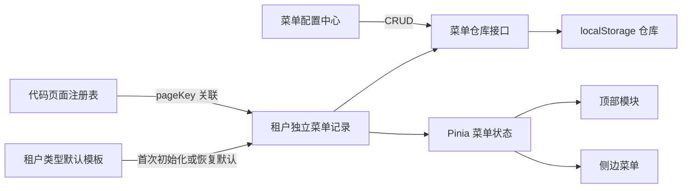

# 租户级菜单配置功能设计

## 1. 背景

当前顶部模块、侧边菜单、默认路径和页面子导航主要写在 `src/config/navigation.ts` 与路由文件中。不同学校、教育局、机构和运营平台只能共享同一类静态配置，无法由管理员针对具体租户调整。

本功能新增运营平台下的“菜单配置”页面，让管理员按具体租户维护顶部模块和侧边菜单。第一期使用 `localStorage` 持久化，但通过仓库接口隔离存储实现，后续可以替换成后端 API。

## 2. 目标

- 支持查询、新增、编辑、删除、拖拽排序、跨级移动和显隐菜单。
- 同时管理顶部模块与侧边菜单，不管理页面内部子 Tab。
- 每个具体租户使用独立菜单配置，数据按 `tenantId` 隔离。
- 新租户首次使用时，按租户类型复制一份默认模板，之后独立修改。
- 内部页面通过 `pageKey` 关联代码中的页面注册表，管理员不填写组件路径。
- 支持目录、内部页面和外部链接三种侧边菜单。
- 配置确认后立即刷新当前租户导航，并在页面刷新后保留。
- 保留后续将 `localStorage` 仓库替换为 API 仓库的边界。

## 3. 非目标

- 不实现低代码页面搭建器。
- 不允许管理员上传或填写 Vue 组件路径。
- 不配置页面内部子 Tab。
- 不实现服务端数据库、服务端鉴权或跨设备同步。
- 不实现租户类型模板的实时继承；模板只在租户首次初始化或手动恢复默认时使用。

## 4. 已确认决策

1. 第一阶段使用 `localStorage`。
2. 页面由开发者实现并注册，菜单只引用页面。
3. 配置范围为顶部模块和侧边菜单。
4. 配置粒度为具体租户，不只是学校、教育局、机构或运营平台类型。
5. 新租户从所属类型的默认模板复制初始配置。
6. 使用运营平台承载的配置页面，通过租户选择器维护任意租户。
7. 菜单使用扁平记录和 `parentId` 建模，渲染时转换为树。
8. 视觉和交互沿用当前 Element Plus 组件及项目设计变量。

## 5. 总体架构



### 5.1 页面注册表

页面注册表是内部页面的代码级唯一来源。每个页面包含：

```ts
interface PageRegistryItem {
  key: string
  title: string
  path: string
  component: RouteComponent
  tenantTypes: TenantType[]
  requiresAdmin: boolean
}
```

- `key` 是菜单保存的稳定引用，不随展示名称变化。
- `path` 和 `component` 只由开发者维护。
- `tenantTypes` 限制页面可被哪些租户类型选择。
- 路由在应用启动时由页面注册表生成，页面路径、组件和标题不再在菜单配置与路由文件中重复维护。
- 菜单配置页面只显示与所选租户类型兼容的页面。

### 5.2 类型默认模板

学校、教育局、机构和运营平台分别保留默认菜单模板。当前 `topNavTabs`、`moduleMenus` 和默认路径迁移为这些模板的初始数据。运营平台默认包含“系统管理 / 菜单配置”，用于超级管理类能力入口。

模板只在两种场景使用：

1. 某个租户还没有独立配置时，复制模板并生成租户自己的记录 ID。
2. 管理员确认“恢复默认模板”时，用最新模板覆盖该租户配置。

模板后续变更不会自动覆盖已初始化租户。

### 5.3 菜单仓库

业务代码只依赖统一仓库接口：

```ts
interface MenuRepositoryLoadResult {
  records: MenuConfigRecord[]
  recoveryNotice: string | null
}

interface TenantMenuRepository {
  list(tenant: TenantInfo): MenuRepositoryLoadResult
  replace(tenant: TenantInfo, records: MenuConfigRecord[]): MenuConfigRecord[]
  reset(tenant: TenantInfo): MenuConfigRecord[]
}
```

第一期实现 `LocalStorageTenantMenuRepository`。后续接入后端时替换仓库实现，不改变页面和 Pinia store 的调用方式。

推荐存储键：

```text
operation-platform:tenant-menu:v1:<tenantId>
```

每个键保存版本号和该租户的完整扁平记录数组。版本号用于后续数据迁移与损坏恢复。

## 6. 数据模型

```ts
type MenuItemType = "module" | "directory" | "page" | "external"
type ExternalOpenMode = "current" | "new-tab"

interface MenuConfigRecord {
  id: string
  tenantId: string
  parentId: string | null
  type: MenuItemType
  name: string
  icon: MenuIconKey | null
  pageKey: string | null
  externalUrl: string | null
  externalOpenMode: ExternalOpenMode | null
  sort: number
  visible: boolean
}
```

约束：

- `module` 必须是根节点，`parentId` 为 `null`。
- `directory` 必须直接归属于 `module`；`page` 和 `external` 可以直接归属于 `module`，也可以归属于 `directory`。
- 第一阶段最多支持“顶部模块 → 目录 → 页面或外部链接”三级结构，不允许目录继续嵌套目录。
- `directory` 不绑定页面或外部地址。
- `page` 必须绑定有效且租户类型兼容的 `pageKey`。
- 同一租户内一个 `pageKey` 只能绑定一个菜单，避免相同路由出现多个激活位置。
- `external` 必须提供 `http` 或 `https` 地址及打开方式。
- 同一父节点下菜单名称不重复。
- 父子关系不能成环。
- 顶部模块的默认目标由排序最前的可见 `page` 或 `external` 子孙节点计算得出。
- 没有可见可导航子孙节点的模块保留在配置中心，但不显示在顶部导航。

## 7. 运行时数据流

### 7.1 应用启动和租户切换

1. 用户 store 确定当前租户。
2. 菜单 store 按 `tenantId` 读取独立配置；如果仓库返回恢复提示，则通知用户数据已恢复。
3. 如果没有配置，则复制该租户类型的默认模板并写入仓库。
4. 菜单 store 将扁平记录转换为树。
5. 顶部导航读取可见 `module` 节点。
6. 侧边栏读取当前模块下的可见子树。
7. 切换租户时完整重复以上流程，不复用前一个租户状态。

### 7.2 内部页面导航

- 菜单通过 `pageKey` 从页面注册表解析路径。
- 页面注册表负责生成内部页面路由，菜单配置不直接加载任意组件。
- 被隐藏或删除的内部页面不出现在导航中。
- 客户端路由守卫检查当前租户是否拥有对应可见菜单；该检查只用于前端体验，不等同于服务端权限控制。

### 7.3 配置变更

1. 配置中心在表单确认前完成字段和树关系校验。
2. 通过仓库保存所选租户的完整记录数组。
3. 如果修改的是当前租户，立即重新加载菜单 store。
4. 如果当前路由对应菜单被隐藏或删除，跳转到该租户第一个可用内部页面。
5. 如果没有可用页面，显示租户菜单空状态。

## 8. 配置中心界面

### 8.1 运营平台入口

- 新增运营平台租户类型 `platform`。
- `/system/menu-config` 由页面注册表生成，并绑定在运营平台租户的默认菜单中。
- 在顶部用户菜单中为管理员保留“菜单配置”快捷入口；点击时先切换到运营平台租户，再进入该页面。
- 该页面标记为管理员页面；非管理员不在运行时导航中看到该入口，路由守卫也会阻止访问。
- 当前原型使用已有角色状态限制入口和路由；真实服务端鉴权不在第一期范围内。

### 8.2 查询区

查询区沿用现有筛选栏样式，包含：

- 租户类型。
- 租户名称，必选。
- 菜单名称关键词。
- 显示状态。
- 查询、重置。

主要操作：

- 新增顶部模块。
- 恢复默认模板。

### 8.3 树形表格

树形表格展示：

- 菜单名称。
- 菜单类型。
- 绑定页面或外部地址摘要。
- 图标。
- 排序值。
- 显示状态。
- 操作。

行操作包括新增子菜单、编辑、删除。树形列表使用 Element Plus `el-tree draggable` 实现拖拽：拖动菜单行可调整同级顺序，也可跨级移动到顶部模块或目录下。筛选菜单名称或显示状态时暂停拖拽，避免只基于局部筛选结果重排完整菜单树。

### 8.4 新增与编辑抽屉

使用 Element Plus 抽屉承载表单。字段根据菜单类型联动：

- 顶部模块：名称、图标、排序、显隐。
- 目录：父级、名称、图标、排序、显隐。
- 内部页面：父级、名称、图标、页面选择、排序、显隐。
- 外部链接：父级、名称、图标、URL、打开方式、排序、显隐。

内部页面采用页面注册表下拉选择，不展示组件路径输入框。

### 8.5 删除与恢复默认

- 删除叶子节点需要二次确认。
- 删除存在子节点的菜单时，明确列出将级联删除的子节点数量。
- 恢复默认模板需要二次确认，并提示当前租户的全部自定义配置会被覆盖。
- 所有确认操作立即保存，无额外“发布”步骤。

## 9. 异常处理

- 数据缺失：从租户类型模板初始化。
- JSON 无法解析、版本不支持或结构校验失败：将原值写入带时间戳的 `operation-platform:tenant-menu:invalid:<tenantId>:<timestamp>` 备份键，恢复默认模板并提示用户。
- 页面注册项失效：树形表格标记“页面不可用”，阻止继续保存该记录；运行时不渲染对应菜单。
- 当前页面菜单被隐藏或删除：跳转到第一个可用内部页面。
- 租户没有可用页面：显示明确空状态。
- 非法 URL、重复同级名称、孤儿节点、循环父子关系：阻止保存并定位到对应字段。
- `localStorage` 写入失败：保留当前界面数据，提示保存失败，不更新运行时菜单。

## 10. 测试策略

项目当前没有测试框架。实现时引入 Vitest 和 Vue Test Utils，覆盖以下范围。

### 10.1 单元测试

- 类型模板复制时生成租户独立 ID。
- 不同 `tenantId` 的数据完全隔离。
- 扁平记录与树结构转换。
- 同级排序。
- CRUD 与级联删除。
- 恢复默认模板。
- 存储数据损坏后的恢复。
- 页面注册表解析与租户类型兼容性。
- 重名、非法父子关系和非法 URL 校验。

### 10.2 组件测试

- 租户筛选与菜单查询。
- 菜单类型切换时表单字段联动。
- 页面选择只展示兼容页面。
- 删除和恢复默认确认流程。
- 保存成功和失败反馈。

### 10.3 浏览器验收

- 为两个同类型学校配置不同菜单，切换租户后分别生效。
- 学校、教育局和机构首次加载各自默认模板。
- 新增、编辑、删除、排序和显隐后导航立即变化。
- 刷新页面后配置仍然存在。
- 内部页面能正常跳转，外部链接按配置打开。
- 当前页面菜单被删除后正确回退。
- 恢复默认模板后导航恢复。

### 10.4 工程检查

- 应用 TypeScript 检查通过。
- Node 配置 TypeScript 检查通过。
- ESLint 通过。
- Vitest 全部通过。
- 生产构建通过。

## 11. 实施边界

实施应聚焦菜单数据源、配置中心和运行时导航，不重构无关业务页面。现有页面内容和页面内子 Tab 保持不变，只将顶部模块、侧边菜单和页面路由映射迁移到新的数据驱动结构。
